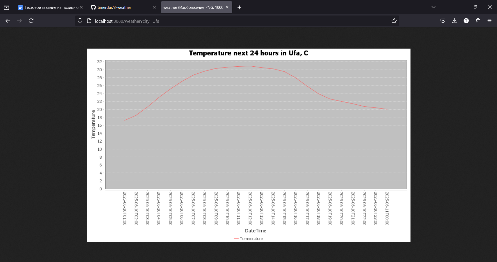

## Сервис прогноза погоды по городам

Предоставляет один endpoint:
GET /weather?city={city}
Где {city} — это название города (например, Moscow, Berlin и т.д.).

В ответ возвращает картинку с графиком температуры в указанном городе. Если город не найден, возвращает ошибку и код ответа 404.

Имеет кэширование с redis: в первую очередь ищет наличие города в redis, если не находит - делает запрос в API геокодинга и погоды, дополнительно сохраняя в redis с lts 900 секунд. Если находит - возвращает из redis.
Если redis недоступен - просто выводит ошибку и ходит постоянно в API.

Используемые внешние API:
Геокодинг города:
https://geocoding-api.open-meteo.com/v1/search?name={city}

Прогноз погоды:
https://api.open-meteo.com/v1/forecast?latitude={lat}&longitude={lon}&hourly=temperature_2m

Внешние библиотеки: Jedis (для интеграции с redis), JFreeChart (для визуализации), Gson (для сериализации)